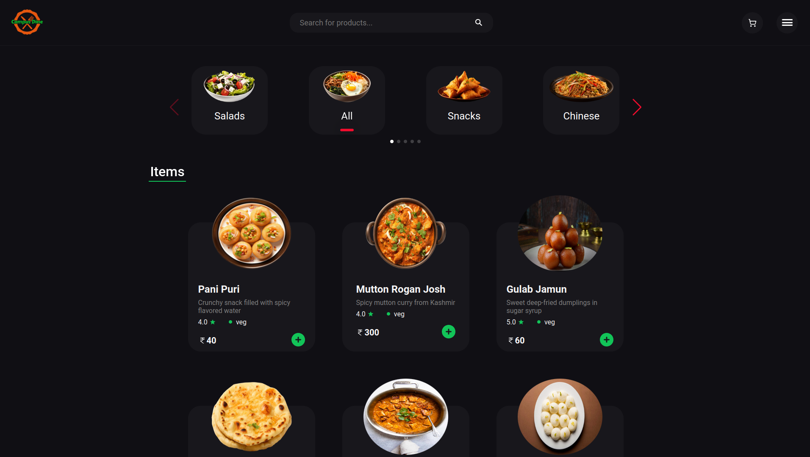
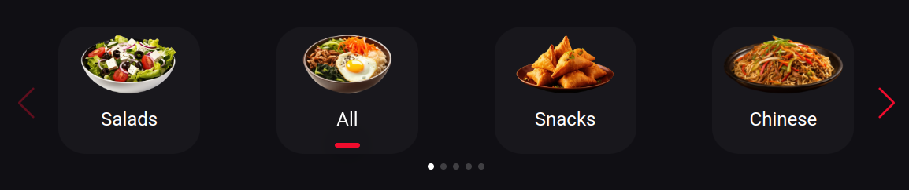
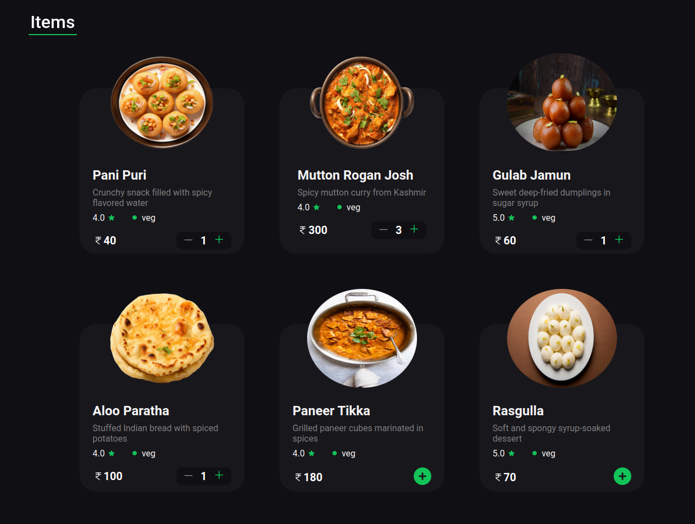
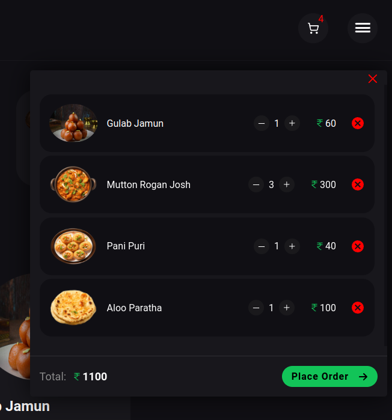
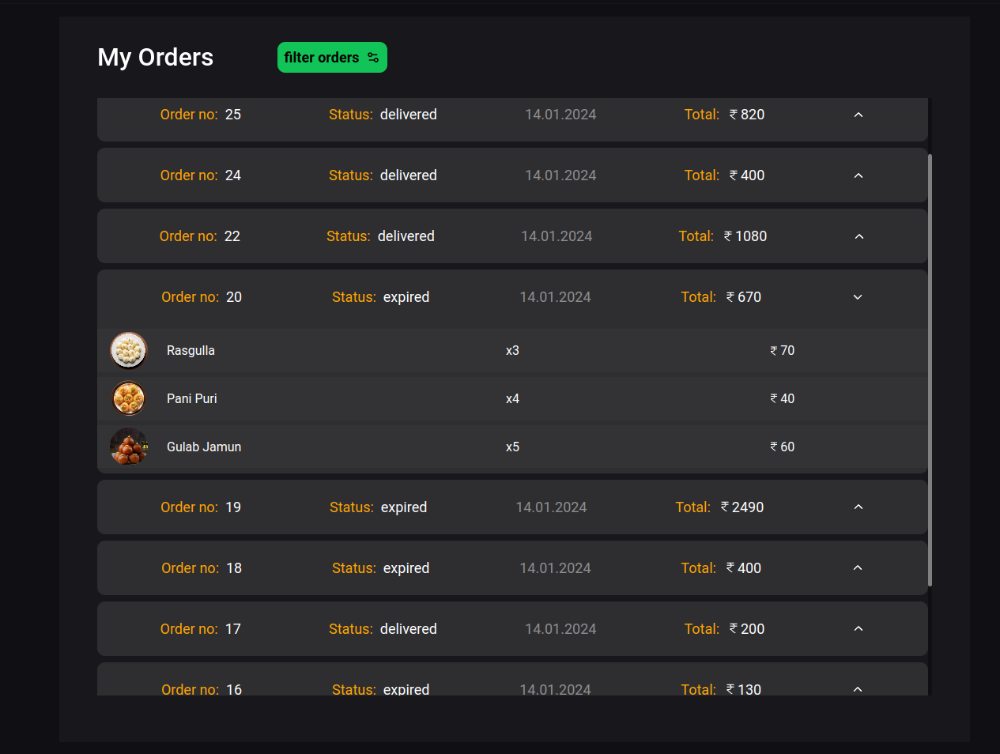
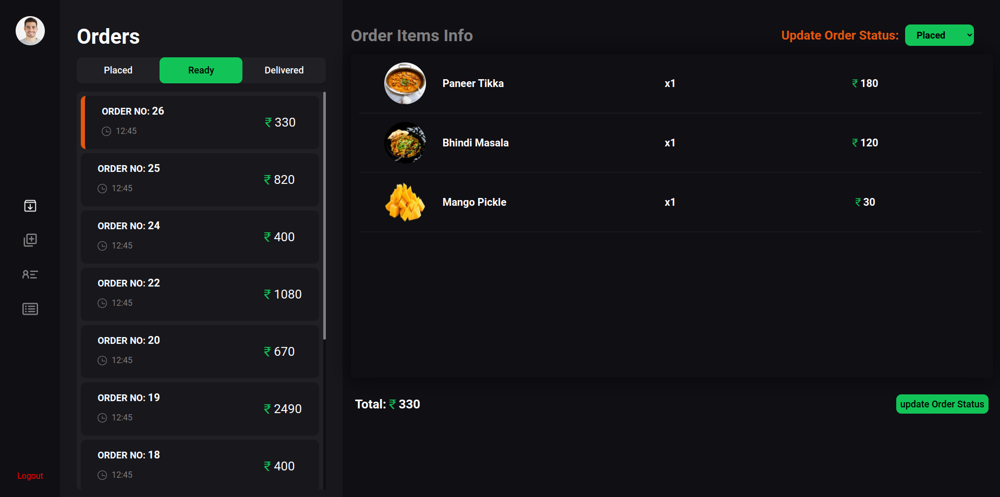
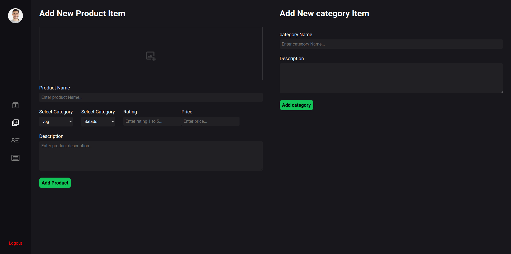
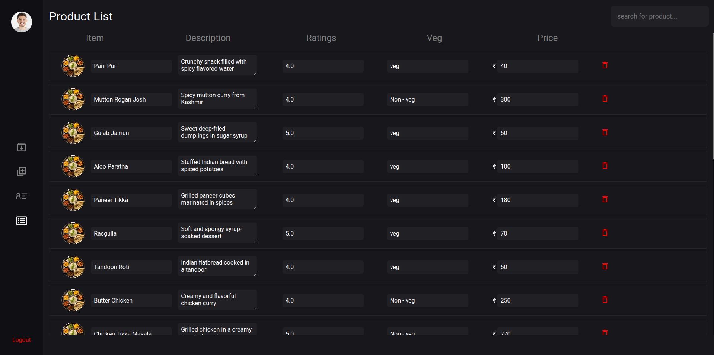

# Canteen Food Ordering Web Application

This web application allows students to place food orders online. It is developed using Express.js, React, Node.js, and MySQL. The application streamlines order management, enabling the college canteen to efficiently receive, prepare, and manage orders for student pickup.

## Features

- **User Interface**: Students can browse the menu, place orders, and track their orders.
- **Admin Interface**: Canteen staff can manage menu items, view and update orders, and track order delivery.
- **API**: A robust backend API to handle order processing, user management, and data storage.

## Installation

### Prerequisites

- Node.js
- npm (Node Package Manager)
- MySQL

### Steps

1. **Clone the Repository**

    ```bash
    git clone https://github.com/yourusername/your-repo-name.git
    cd your-repo-name
    ```

2. **Install Dependencies**

    Navigate to the backend directory and install the dependencies:

    ```bash
    cd backend
    npm install
    ```

    Then, navigate to the frontend directory and install the dependencies:

    ```bash
    cd ../frontend
    npm install
    ```

    Then, navigate to the admin directory and install the dependencies:

    ```bash
    cd ../admin
    npm install
    ```

3. **Set Up MySQL Database**

    Create a new MySQL database and run the provided SQL script to set up the required tables.

4. **Set Up Environment Variables**

    Copy the sample environment file to create a new `.env` file and add your database credentials:

    ```bash
    cp backend/.env.sample backend/.env
    ```

    Edit the `backend/.env` file to include your database credentials:
```
PORT=5000
MYSQL_DB_HOST="db host url"
MYSQL_DB_PORT="dbport"
MYSQL_DB_USER="dbUsername"
MYSQL_DB_PASSWORD="password"
MYSQL_DB_DATABASE=CampusDine
```

5. **Run the Application**

    Start the backend server:

    ```bash
    cd backend
    npm start
    ```

    Start the frontend development server:

    ```bash
    cd ../frontend
    npm start
    ```

6. **Access the Application** at

    Open your browser and go to `http://localhost:5173` for user interface.
	Open your browser and go to `http://localhost:5174` for admin interface.


## Screenshots

### Client side interface screenshots












### Admin Dashboard screenshots








## Contributing

Contributions are welcome! Please open an issue or submit a pull request for any improvements or bug fixes.
