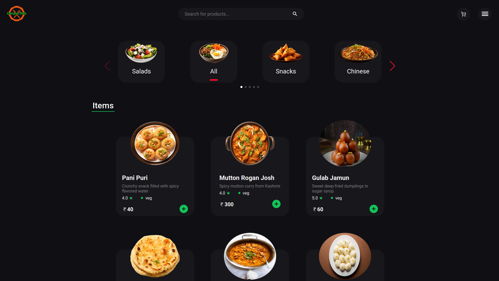
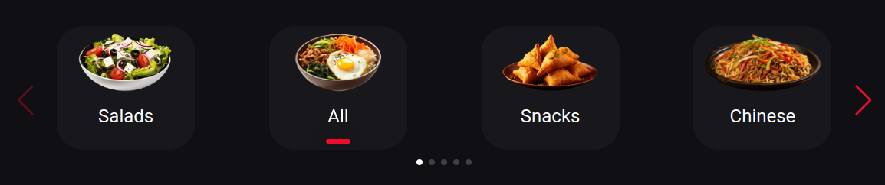
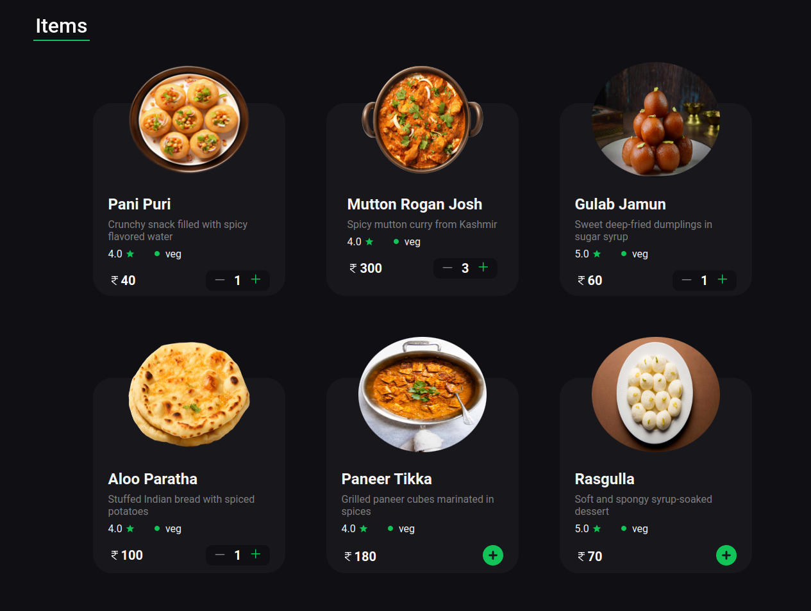
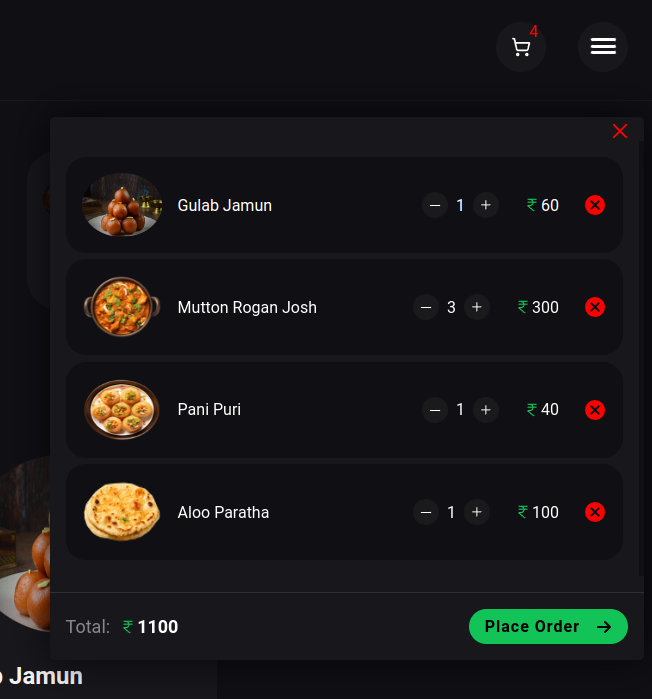
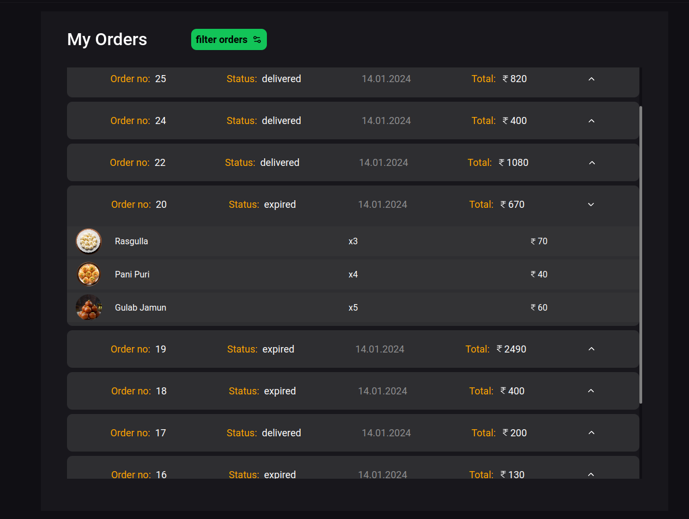
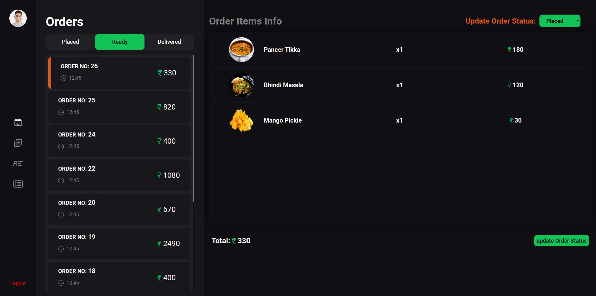
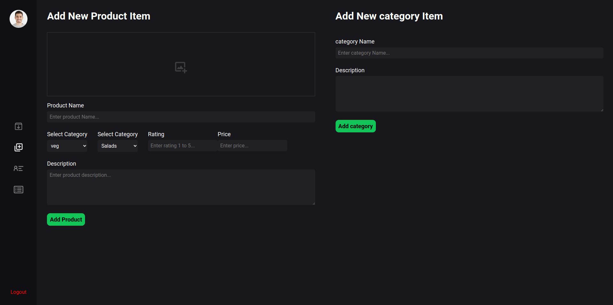
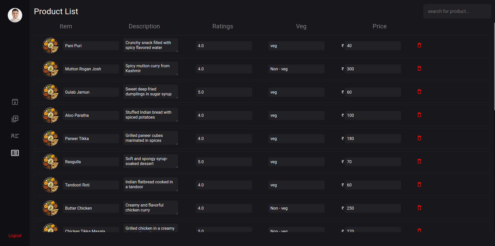

# Canteen Food Ordering Web Application

A comprehensive web application for college canteen food ordering system. Students can browse menus, place orders, and track their orders, while canteen staff can manage menu items, view orders, and update order status through an admin dashboard.

## 🚀 Features

- **User Interface (Client)**: 
  - Browse menu items by categories
  - Add items to cart
  - Place orders with pickup time selection
  - Track order status in real-time
  - User authentication and profile management

- **Admin Interface**: 
  - Manage menu items (add, edit, delete)
  - Manage categories
  - View and update order status
  - Track order delivery
  - Monitor order statistics

- **Backend API**: 
  - RESTful API built with Express.js
  - MySQL database integration
  - JWT authentication
  - File upload support for images
  - Automated order expiration handling

## 📋 Prerequisites

Before you begin, ensure you have the following installed on your system:

- **Node.js** (v14 or higher) - [Download](https://nodejs.org/)
- **npm** (comes with Node.js) or **yarn**
- **MySQL** (v5.7 or higher) - [Download](https://dev.mysql.com/downloads/)
- **Git** (optional, for cloning)

## 🛠️ Installation & Setup

### Step 1: Clone the Repository

```bash
git clone https://github.com/yourusername/your-repo-name.git
cd your-repo-name
```

Or download and extract the ZIP file to your desired location.

### Step 2: Install Dependencies

The project consists of three separate applications. Install dependencies for each:

**Install API dependencies:**
```bash
cd api
npm install
```

**Install Client dependencies:**
```bash
cd ../client
npm install
```

**Install Admin dependencies:**
```bash
cd ../admin
npm install
```

### Step 3: Set Up MySQL Database

1. **Create the Database:**
   - Open MySQL command line or MySQL Workbench
   - Create a new database named `CampusDine`:
   ```sql
   CREATE DATABASE CampusDine;
   USE CampusDine;
   ```

2. **Create Tables:**
   - Copy the SQL script from `api/db.txt`
   - Execute the entire script in your MySQL client
   - This will create all necessary tables: `Users`, `Categories`, `Products`, `Orders`, `OrderItems`, and `OrderStatus`

3. **Optional - Insert Sample Categories:**
   - The `db.txt` file also contains sample INSERT statements for categories
   - You can run these to populate initial category data

### Step 4: Configure Environment Variables

1. Navigate to the `api` directory:
   ```bash
   cd api
   ```

2. Create a `.env` file in the `api` directory with the following content:

   ```env
   PORT=5000
   MYSQL_DB_HOST=localhost
   MYSQL_DB_PORT=3306
   MYSQL_DB_USER=root
   MYSQL_DB_PASSWORD=your_mysql_password
   MYSQL_DB_DATABASE=CampusDine
   CORS_ORIGIN=http://localhost:5173,http://localhost:5174
   ```

   **Important:** Replace the following with your actual MySQL credentials:
   - `MYSQL_DB_HOST`: Your MySQL host (usually `localhost`)
   - `MYSQL_DB_PORT`: Your MySQL port (usually `3306`)
   - `MYSQL_DB_USER`: Your MySQL username (usually `root`)
   - `MYSQL_DB_PASSWORD`: Your MySQL password
   - `MYSQL_DB_DATABASE`: Database name (should be `CampusDine`)

### Step 5: Run the Application

You need to run **three servers simultaneously** in separate terminal windows/tabs:

**Terminal 1 - Start the API Server:**
```bash
cd api
npm start
```
For development with auto-reload:
```bash
npm run dev
```
The API server will run on `http://localhost:5000`

**Terminal 2 - Start the Client (User Interface) Server:**
```bash
cd client
npm run dev
```
The client will run on `http://localhost:5173`

**Terminal 3 - Start the Admin Interface Server:**
```bash
cd admin
npm run dev
```
The admin interface will run on `http://localhost:5174`

## 🌐 Access the Application

Once all servers are running:

- **User Interface**: Open your browser and navigate to [http://localhost:5173](http://localhost:5173)
- **Admin Interface**: Open your browser and navigate to [http://localhost:5174](http://localhost:5174)
- **API Base URL**: [http://localhost:5000/api/v1](http://localhost:5000/api/v1)

## 🔐 Login Credentials

### For Regular Users (Client Side)

**Option 1: Register a New User**
1. Go to [http://localhost:5173](http://localhost:5173)
2. Click on "Register" or "Sign Up"
3. Fill in your details (email, username, password)
4. You'll be automatically logged in after registration

**Option 2: Use Existing User**
If you have existing users in your database, you can log in with:
- **Email**: The email you registered with
- **Password**: The password you set during registration

### For Admin Users (Admin Side)

**Important**: Admin users must be created directly in the database. There are two ways to do this:

**Method 1: Create Admin User via SQL (Recommended)**

1. Open MySQL command line or MySQL Workbench
2. Connect to your `CampusDine` database
3. Run the following SQL script (replace with your desired credentials):

```sql
-- First, hash your password using bcrypt (you'll need Node.js for this)
-- Or use this SQL to insert with a hashed password
-- Password: "admin123" (hashed with bcrypt, rounds=10)
-- You can generate your own hash using: bcrypt.hash("yourpassword", 10)

INSERT INTO Users (userId, username, email, password, role, avatar, createdAt, updatedAt)
VALUES (
  UUID(),  -- or generate a UUID
  'admin',
  'admin@example.com',
  '$2b$10$rOzJqZqZqZqZqZqZqZqZqOZqZqZqZqZqZqZqZqZqZqZqZqZqZqZqZq',  -- Replace with your bcrypt hashed password
  'admin',
  'noProfile.png',
  CAST(UNIX_TIMESTAMP(NOW()) * 1000 AS CHAR),
  CAST(UNIX_TIMESTAMP(NOW()) * 1000 AS CHAR)
);
```

**Method 2: Update Existing User to Admin**

If you already have a user account, you can update their role to admin:

```sql
UPDATE Users 
SET role = 'admin', updatedAt = CAST(UNIX_TIMESTAMP(NOW()) * 1000 AS CHAR)
WHERE email = 'your-email@example.com';
```

**Quick Admin Setup Script**

To quickly create an admin user, you can use this Node.js script:

1. Create a file `create-admin.js` in the `api` directory:

```javascript
import bcrypt from 'bcrypt';
import connectDB from './config/db/index.js';
import { generateUUID } from './utils/uuid.js';
import dotenv from 'dotenv';

dotenv.config();

const createAdmin = async () => {
  const db = await connectDB();
  try {
    const email = 'admin@example.com';  // Change this
    const username = 'admin';            // Change this
    const password = 'admin123';          // Change this
    
    const hashedPassword = await bcrypt.hash(password, 10);
    const userId = generateUUID();
    const timestamp = Date.now().toString();
    
    const [result] = await db.execute(
      `INSERT INTO Users (userId, username, email, password, role, avatar, createdAt, updatedAt)
       VALUES (?, ?, ?, ?, ?, ?, ?, ?)`,
      [userId, username, email, hashedPassword, 'admin', 'noProfile.png', timestamp, timestamp]
    );
    
    if (result.affectedRows > 0) {
      console.log('✅ Admin user created successfully!');
      console.log(`Email: ${email}`);
      console.log(`Password: ${password}`);
    }
  } catch (error) {
    console.error('Error creating admin:', error.message);
  } finally {
    if (db) db.release();
  }
  process.exit(0);
};

createAdmin();
```

2. Run the script:
```bash
cd api
node create-admin.js
```

**Default Admin Credentials (if using the script above):**
- **Email**: `admin@example.com`
- **Password**: `admin123`

⚠️ **Security Note**: Change these default credentials immediately after first login!

## 📁 Project Structure

```
Dine/
├── api/                 # Backend API (Express.js + MySQL)
│   ├── config/         # Database configuration
│   ├── controllers/    # Request handlers
│   ├── middlewares/    # Custom middlewares
│   ├── models/         # Database models
│   ├── routes/         # API routes
│   ├── utils/          # Utility functions
│   ├── db.txt          # Database schema SQL script
│   ├── server.js       # Server entry point
│   └── app.js          # Express app configuration
├── client/             # User interface (React + Vite)
│   ├── src/           # Source files
│   └── package.json
├── admin/              # Admin interface (React + Vite)
│   ├── src/           # Source files
│   └── package.json
└── screenshots/        # Application screenshots
```

## 🔧 API Endpoints

The API follows RESTful conventions. Base URL: `http://localhost:5000/api/v1`

**User Routes** (`/api/v1/users`):
- Authentication endpoints
- Product browsing
- Order management
- Profile management

**Admin Routes** (`/api/v1/admin`):
- Menu management
- Order management
- Category management
- Statistics

**Test Endpoint**: `GET /api/v1/test` - Returns "hello world!" to verify API is running

## 🐛 Troubleshooting

### API Server Won't Start

- **Database Connection Error**: 
  - Verify MySQL is running
  - Check `.env` file has correct database credentials
  - Ensure `CampusDine` database exists
  - Verify all tables are created (run SQL script from `db.txt`)

- **Port Already in Use**:
  - Change `PORT` in `.env` file to a different port (e.g., 5001)
  - Or stop the process using port 5000

### Client/Admin Won't Connect to API

- **CORS Error**: 
  - Ensure `CORS_ORIGIN` in `.env` includes both client URLs
  - Format: `CORS_ORIGIN=http://localhost:5173,http://localhost:5174`

- **API Not Running**: 
  - Verify API server is running on port 5000
  - Check API server terminal for error messages

### Port Conflicts

- If ports 5173 or 5174 are already in use:
  - The Vite dev server will automatically try the next available port
  - Or manually configure ports in `vite.config.js`

### Database Issues

- **Tables Not Found**: Run the SQL script from `api/db.txt` again
- **Connection Refused**: Check MySQL service is running
- **Access Denied**: Verify MySQL username and password in `.env`

## 📝 Notes

- The application uses JWT (JSON Web Tokens) for authentication
- Image uploads are handled via Multer
- Order expiration is automatically handled by a cron job
- All timestamps are stored as strings in milliseconds

## 🤝 Contributing

Contributions are welcome! Please feel free to submit a Pull Request. For major changes, please open an issue first to discuss what you would like to change.

## 📄 License

This project is open source and available for educational purposes.

## 📸 Screenshots

### Client Side Interface







### Admin Dashboard




